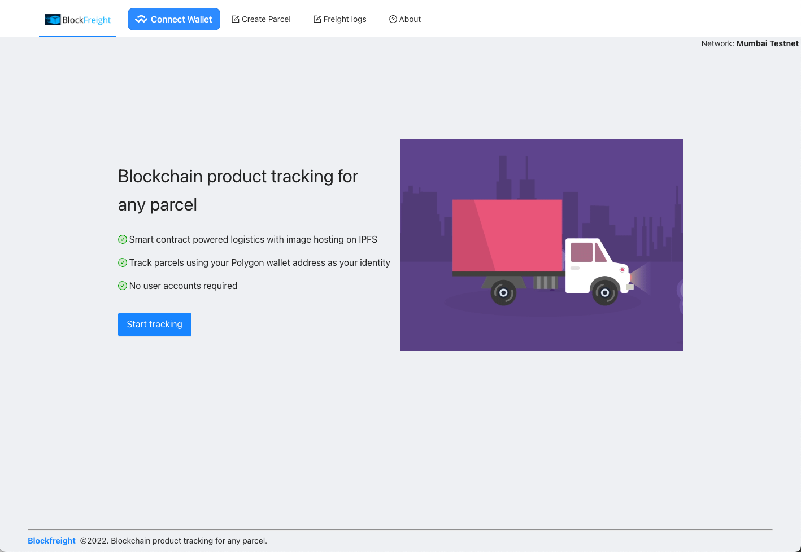

    

 

Blockfreight
---

Due: 11/12/2022

### Motivation

Often excel spreadsheets that track the history of inventory and deliveries are shared via email.

For those vendors using existing SaaS platforms (such as Flexport) much of that data is only held within Flexport, subject to terms and conditions, and can be modified by their team.

By using Polygon contracts, Blockfreight can:
1. Enable an immutable, append-only, history of interactions with given parcels.
2. Create a permission framework (optional) that enforces only certain wallets or user accounts can log events against a given item.
3. Store the data in a transparent way for all parties, where no single party has to be the custodian of the data log.

### Solution

Blockfreight is a blockchain product tracking platform for any parcel.

Generates a unique QR code that can either be presented or placed on the cargo of interest. Could also be placed on a truck.

Give other projects temporary access to data based on smart contract rules

### Technologies used

Polygon: Serves as the primary smart contract network for the Blockfreight application. Polygon enables fast and low cost smart contract transactions that make it easy to use Blockfreight in the field without heavy additional costs or time delays.
Chainlink: Grab information from port and pull into the application
IPFS: Record keeping and storage. Ability to upload new images of the cargo at different checkpoints or if the status of the item has changed visibly (ex: damage).

### Challenges

### Contracts
* Useful link: https://hardhat.org/tutorial/writing-and-compiling-contracts

### Running the app

Define the follow environment variables.

<pre>
REACT_APP_COVALENT_KEY= // Your covalent API key.
REACT_APP_STORAGE_KEY=  // Your web3.storage key.
REACT_APP_ACTIVE_CHAIN_ID= // 80001 or 137 currently for polygon testnet or mainnet (defaults to testnet).
REACT_APP_WC_ID= // cloud.walletconnect.com app id (defaults to a demo app id).
</pre>

`yarn; yarn start`

Blockfreight should now be running on port 3000.

### Screenshots

#### Home

### Potential future work
* Add subscription costs for creating different record types, auditing, and organization permissioning.
* Enable data export of blockchain logs to more native or traditional formats such as excel or pdf.
* Add support for user logins in addition to metamask (or wallet-based) logins.

<!--

TODO: research on flexport and determine how to make blockchian compatible.

Demo flow:
Article stating problem
Intro solution / website
Closing (github+future work)

Make smart contract transaction at a checkpoint scan.

Social good idea

(e.g., sustainability, tackling the energy & logistic crises, preventing misinformation). Teams may create an oracle for Filecoin Green data, use Arbol data or build tools to establish information provenance.

-- Sponsors--
Smart contract for delivery or record keeping
Polygon: Low cost smart contract transactions
Chainlink: Grab information from port and pull into the application
IPFS: Record keeping and storage

-->

### TODO:
* QR code system for attaching to parcels.
* Scan creates a transaction against the parcel's smart contract (immutable and identity-tracking)
* Persistent storage 
* Smartcontract deployment for each parcel.

### Useful links
* https://chainlinkfall2022.devpost.com/
