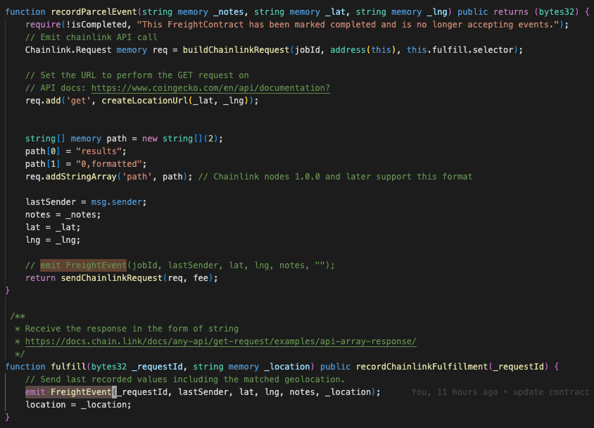

 

    

 

Blockfreight
---

Blockfreight is a blockchain product tracking platform for any parcel.

Generates a unique blockchain-backed QR code that can either be presented or placed on the cargo of interest.

Built for the <a href="https://chainlinkfall2022.devpost.com/" target="_blank">Chainlink Fall 2022 hackathon.</a>

Live Demo: <a href="https://blockfreight.surge.sh" target="_blank">Blockfreight</a>

Must be on Polygon testnet (Mumbai) for demo.

### Motivation

Often excel spreadsheets that track the history of inventory and deliveries are shared via email.

For those vendors using existing software platforms (such as Flexport), much of the data is only held centrally within those platforms, subject to custom terms and conditions, and modifiable by their internal teams. Also often need to have a formal app B2B subscription plan.

Other common challenges that occur outside of platforms can include limitations from the non-universal nature of email (emails are private between sender and recipient), delays might not be accurately or consistently reported, and products might be lost.

Using Polygon smart contracts, Blockfreight can:
1. Enable an immutable, append-only, history of interactions with given parcels.
2. Create a permission framework (optional) that enforces only certain wallets or user accounts can log events against a given item.
3. Store the data in a transparent way for all parties, where no single party has to be the custodian of the data log.
4. Perform low cost and fast transactions.

### Technologies used

**Polygon**: Serves as the primary smart contract network for the Blockfreight application. Polygon enables fast and low cost smart contract transactions that make it easy to use Blockfreight in the field without heavy additional costs or time delays.

**Chainlink**: Grab information from port and pull into the application. Uses an on-chain API call for reverse geolocation (via https://www.geoapify.com/reverse-geocoding-api) to store the provided lat/lng as a formatted location. For example, a known location of a shipping warehouse can automatically be pulled and saved on the smart contract without having the user type anything.

**IPFS**: Record keeping and storage. IPFS is used as the backend for the QR code scanning data lookup and enables theaAbility to upload new images of the cargo at different checkpoints or if the status of the item has changed visibly during transit (ex: item experienced damage). Notes uploaded are also saved to the contract.

Every completed freight update via the QR code emits a `FreightEvent` that gets indexed and appended to the parcel's contract.

<pre>
    emit FreightEvent(_requestId, lastSender, lat, lng, notes, _location);
</pre>

### Useful links
* Hardhat: https://hardhat.org/tutorial/writing-and-compiling-contracts
* Chainlink API parsing: https://docs.chain.link/docs/any-api/get-request/examples/api-array-response/
* Hackathon: https://chainlinkfall2022.devpost.com/
* Common supply chain / shipping problems: https://www.bluecart.com/blog/common-shipping-issues

### Running the app

Define the follow environment variables.

<pre>
    REACT_APP_COVALENT_KEY= // Your covalent API key (optional - needed from history tab)
    REACT_APP_STORAGE_KEY=  // Your web3.storage key.
    REACT_APP_ACTIVE_CHAIN_ID= // 80001 or 137 currently for polygon testnet or mainnet (defaults to testnet).
    REACT_APP_WC_ID= // cloud.walletconnect.com app id (defaults to a demo app id).
</pre>

`yarn; yarn start`

Blockfreight should now be running on port 3000.

<b>Note this project is currently a prototype and would require additional work to be production ready on Polygon mainnet.</b>

### Potential future work
* Add subscription costs for creating different record types, auditing, and organization permissioning.
* Enable data export of blockchain logs to more native or traditional formats such as excel or pdf.
* Add support for user logins in addition to metamask (or wallet-based) logins.

## Screenshots / User flow

### Home

### Creating a new parcel contract

### Connecting wallet for contract deployment

### Confirm contract creation

### Contract created!

### IPFS record on contract creation

### Contract Metadata 

### QR code

### Printing QR code

### Providing a freight contract update

### Freight update transaction added to contract record

### Freight update event is emitted from the contract

### Chainlink api call to reverse geocode latitutude/longitude to address string.

### Freight history lookup

<!--

Demo flow:
Web Article stating problem (flexport)
- https://www.flexport.com/
- https://www.bluecart.com/blog/common-shipping-issues
Intro solution / website
Connect wallet
Create blockfreight
- Original box image (IPFS/Filecoin for persistent, decentralized storage.)
- Adds funds to the contract to do chainlink interaction
Show deployed contract (Polygon, good for high volume packages or shipments)
- Show QR Code
- Print screen/preview
Send a contract update with notes.
- Damaged box image
Show contract event emitted from contract and new transaction.
- Reverse geocoding https://www.geoapify.com/reverse-geocoding-api on Chainlink contract
Show contract history.
Closing (github+future work)

Make smart contract transaction at a checkpoint scan.

Social good idea

(e.g., sustainability, tackling the energy & logistic crises, preventing misinformation). Teams may create an oracle for Filecoin Green data, use Arbol data or build tools to establish information provenance.

-- Sponsors--
Smart contract for delivery or record keeping
Polygon: Low cost smart contract transactions
Chainlink: Grab information from port and pull into the application
IPFS: Record keeping and storage

-->

